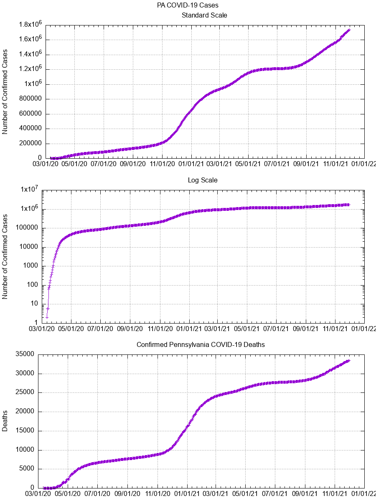
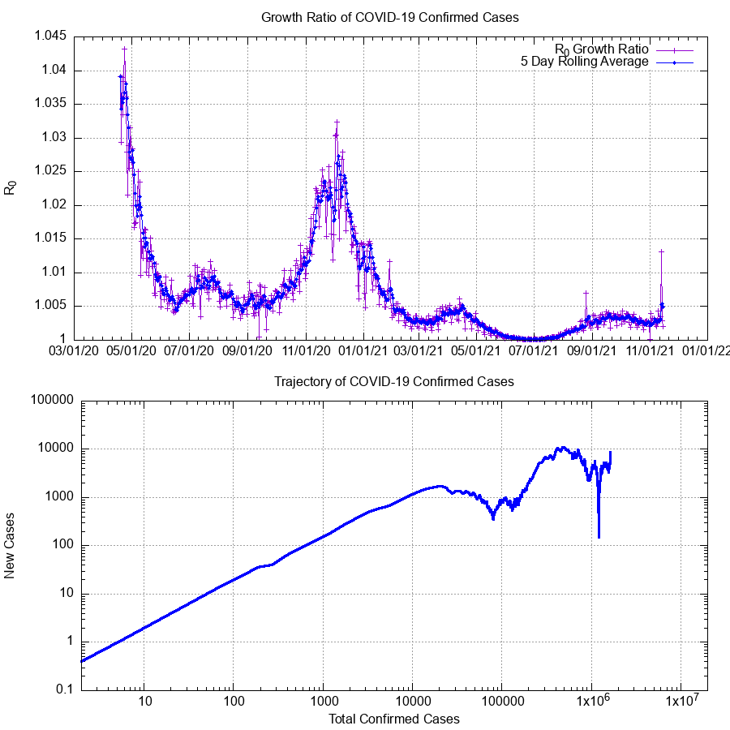
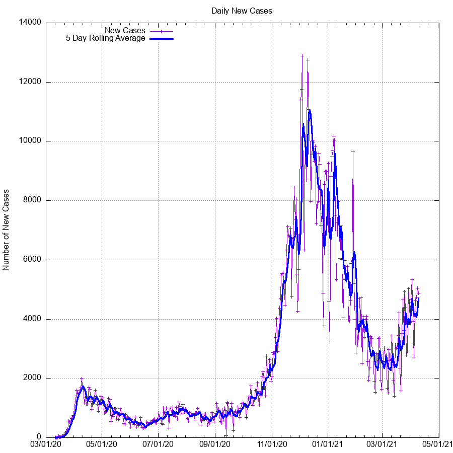

# Pennsylvania Coronavirus COVID-19 Scraper

In an effort to reduce the amount of strain on the Pennsylvania
Department of Health websites during the peak hours (especially around noon
when the daily updated information is posted), this script was created to quickly
and easily parse the information without any additional overhead.

The script can optionally highlight certain counties which you may be interested
in- in my case, I'm interested in Lancaster and Schuylkill counties.
If you wish to highlight different counties, simply update the array in the script.

I gave a brief talk about this repository as part of TechLancaster.
The video is available [here](https://youtu.be/c3zoHHA-1Nw).

This repository contains several different items, each for their own
purpose.

1. Website scrape script, to allow for easy view of updated info
2. GnuPlot scripts, to graph and visualize the data
3. PostgreSQL scripts, to allow for storage and further analysis of the data

### Using the Web Scraper Script

To use this script, simply run it:
```
python covid.py
```

It's recommended that a virtualenv is used, for sanity reasons:

```
virtualenv env
source env/bin/activate
pip install -r requirements.txt
python covid.py
```


**NOTE:** Please be mindful that this script will still (in a minor way)
affect the bandwidth of the host. Please do not use this script to poll the
site more often than once every hour or so. The data does not change that often.

### Plot Generation
The scripts and data used to generate the graphs are also included in the
repository.

The data is not automatically populated in to the `gnuplot` data file, it is
instead calculated separately following the daily PA Dept of Health update,
and provided as described in this repository, so that careful attention can be
provided to ensure validity.
The calculations for every value, aside from the two provided by the Dept of
Health (Daily total cases and Daily total deaths) are performed by the
[daily_update.sql](https://github.com/tomswartz07/covid19-pennsylvania/blob/master/daily-update.sql)
script, which is then provided here for reference.

Simply install `gnuplot` and run:

```
gnuplot plot_PA_Cases.gpi
```

The image file will be updated at `cases.png`, `new_cases.png`, `trajectory.png`
and any other images selected for generation by the gnuplot script.

### PostgreSQL Database
The daily information, such as the new cases, new fatalities, and other
calculated info should be stored in a database for ease of use and to allow for
powerful querying features.
In an effort to allow for easy duplication of the setup, a `schema.sql` file is
provided to allow for a duplicate Postgres database to be used.

To set this up, ensure you have a working Postgres database, then run
```
psql < schema.sql
```
You may then load the data as you see fit, including external sources as
referenced in the schema file.
The schema file is annotated with comments indicating each section and it's
usage.

For convenience, a daily update SQL script has been provided as well, allowing
for easy and quick updating of the various stats which are not provided by the
Department of Health.

A further bonus of having the information in a database is the ability to hook
external tools into it for visualization and data processing uses, such as
Grafana.

At the conclusion (if there ever is one) of the major part of the infection in
the Pennsylvania or United States as a whole, an entire `pg_dump` file will be
provided, which contains all of the daily case counts as well as other PA events.
This information can be used as a good 'sample database' for various projects,
as the column types are varied and split across several unique tables.

## Updating Process
Typically, a daily update process is as follows:
1. Insert the daily data into the db:
    ```sql
    INSERT INTO covid19.covid19pa (date, confirmed, deaths) VALUES ("YYYY-MM-DD", ###, ###);
    ```
2. Run the daily update script:
    ```sh
    psql --file=daily-update.sql
    ```
3. Plot the data:
    ```sh
    gnuplot plot_PA_Cases.gpi
    ```
4. Update any daily events, if necessary:
    ```sql
    INSERT INTO covid19.pa_events (time, text) VALUES ('YYYY-MM-DD HH:MM:SS-4', 'Event');
    ```

Putting it all together, as a one-liner, this is my daily update script:
```sh
psql -d $db_name -h $hostname -c "insert into covid19.covid19pa \
(date, confirmed, deaths) values \
(CURRENT_DATE, 77999, 6162);"; \
psql -d $db_name -h $hostname --file=daily-update.sql; \
gnuplot plot_PA_Cases.gpi; \
git add .; \
git diff --staged; \
git commit -m "$(date +"%d %b %Y") Data";\
git push
```
## Current Cases

Below are graphs of confirmed cases, fatalities, and other potentially useful
data generated using the most recent available data and `gnuplot`.

R<sub>0</sub> is the 'Growth Factor'.
In the most basic terms, this is how many new cases are created by existing
cases.





For more information on how to read the trajectory
graph, please see this excellent video by Henry Reich of
[MinutePhysics](https://www.youtube.com/watch?v=54XLXg4fYsc).



## Calculation Formulæ

The only two datapoints provided by the PA Department of Health are
`cases` and `deaths`.
The other values are calculated using reasonable estimations and approximations
to the scientific models.

This section will describe how the calculations are performed and the formulae
for each value shown in `cases.data`.

**Variables:**
- C<sub>t</sub>: Today's value for cases
- C<sub>t-1</sub>: Yesterday's value for cases

1. **New Cases:** The difference between the current value and the previous days value.
- C<sub>t</sub> - C<sub>t-1</sub>
2. **Growth Ratio:** The ratio of current cases to previous days cases. Rough approximation of the "R<sub>0</sub> Infectivity Rate".
- C<sub>t</sub> / C<sub>t-1</sub>
3. **Estimated Day:** The estimated number of cases for the day, based upon the growth ratio.
- C<sub>t-1</sub> * Growth Ratio<sub>t-1</sub>
4. **Off By:** The difference between the estimate and the actual daily count.
- -1 * (Estimated Day<sub>t</sub> - C<sub>t</sub>)
5. **Pct Error:** The percent error calculated for the difference between the estimated count and the actual count.
- ABS((Estimated Day<sub>t</sub> - C<sub>t</sub>) / C<sub>t</sub>)

Also of note, the `daily-update.sql` file includes the full calculations for
each of these items, allowing the database to calculate the values automatically.

## Extended Information

Because the data is stored in a database, there is much more flexibility for
querying and interacting with the data.

Some examples include:

**Viewing New Daily Cases, Per-County**

If using the full data information, including the new case counts from [NYT
data repository](https://github.com/nytimes/covid-19-data), then county-by-county
information is also available.

```sql
SELECT distinct on (county)
  county AS "County",
  date::timestamptz AS "Date",
  lag(cases, 1) over (partition by county order by date::timestamptz) as "Previous Cases",
  cases as "Current Cases",
  cases - lag(cases, 1) over (partition by county order by date::timestamptz) as "New Cases"
FROM covid19.covid19us
WHERE
  state = 'Pennsylvania'
ORDER BY 1,2 desc
;
```

## Disclaimers

This information is provided as part of an amateur attempt to analyze the data.
This information should not be interpreted as exact scientific analysis, nor
has it been peer reviewed in any way.
Nonetheless, every attempt has been made to validate the accuracy of the
numbers, such as providing a value of percent-error and a steadfast policy of +1
day estimations, only.

The only 'exact' values are those for the daily cases, deaths, and net daily-new
cases, insofar as they have been reported by the Pennsylvania Department of
Heath.
For example, the values for R<sub>0</sub> are approximations, at best.
For more precise R<sub>0</sub> calculations, [other
sources](https://github.com/k-sys/covid-19/blob/master/Realtime%20R0.ipynb)
should be used instead.

For a more scientific and precise analysis, it is recommended that you seek out
reporting performed by actual epidemiologists and data scientists.

## Notable Changes

- 22 Apr 2020: The PA Dept of Health began providing 'probable' cases and
  deaths, alongside confirmed data.
  Because until this point, all data were assumed to be probable (and most likely)
  the calculations will continue to use this metric.
  Reasonable accommodations will be made to integrate the probable cases into error
  calculations, where possible.
  It's also important to note that the numbers do not identify which counties in
  particular are included in the 'probable' counts, so it's presently impossible
  do differentiate or reconcile the numbers.

- 27 Apr 2020: Updated method for creating the data file. Previously, data for
  each day was computed by manual processes in a spreadsheet. As of today, all
  calculated values are processed by the database and provided as output
  (i.e. there is no spreadsheet involved anymore). As a result, this allows for
  a more 'open' view of calculations, since the `.sql` file used to update the
  daily values can also be provided for replication elsewhere.
  Notably, the plotted output does not change between this and the parent
  commit, strongly indicating that there are no changes to the fundamental data.

- 7 May 2020: Updated plot method for Trajectory graph. This averaging plot
  (as opposed to the previous exact data plot) more closely matches the ideals
  and functions behind the original plot design from MinutePhysics. It is a
  'pessimistic' interpretation of the data, and will therefore show a downturn
  more clearly when the increase of infection rate is slowing.

- 27 May 2020: As a fun little add on, the decoded text version of the genome has
  been added to the repository.

- 3 Jun 2020: Changed the range for the Growth Ratio plot to provide more detail
  in the recent data, as it begins to asymptotically approach a value of `1`. As
  such, this graph now only shows data >30 days in. Once the overall event has
  slowed to 'near completion', the range of this plot will be re-opened to show
  the growth ratio over the entire course of the event.

- 8 Jun 2020: Due to changes in the data presented on the PA Department of Health
  site, the script is no longer functioning. Apparently they're only updating the
  ArcGIS site now, and posting that as an iframe in the page, like it's the year
  1999 or something. Efforts will be made to obtain the previously available data
  output from previous days, but until they provide a tabular format, it seems
  unlikely.

- 9 Jun 2020: Partial restore of the previously available data. Until the DoH
  restores the county-by-county table, no fully verbose info can be provided.
  However, info on when the pages have been updated (for manual retrieval) as
  well as a rough total case count is available. The DoH frequently changes the
  formatting of this number throughout the day, so it may contain newline and
  extraneous characters. They never said they were computer experts…

- 20 Jun 2020: The Dept of Health is no longer updating the pages over the weekends.
  This means that the numbers obtained via the script will not reflect the actual
  data, and must be manually calculated from the ArcGIS map. Obviously, this is
  not an ideal situation, but as the numbers wane, it is an expected change.
  All attempts will be made to accurately show the numbers as updated from the
  page content. This only further emphasizes the need for repositories of data such
  as this one.

- 27 Jun 2020: In addition to no longer updating the pages over the weekend, the
  actual data entry for fatalities (and possibly cases) is not accurate over the
  weekend. It can be assumed that 'Monday Data' will be higher than average to
  account for the discrepancy in the missing weekend data. Because the plots and
  graphs have normalization and X-day averaging, this should not affect the overall
  data visualizations.

- 12 Jul 2020: PA Department of Health reports that their ArcGIS dashboard is
  'down for maintenance' for all of the 12th, and most of the 13th. Direct link
  to the dashboard shows that it has recent data, but it is uncorroborated by
  other available resources. Data for this day may be updated/amended in the coming
  days, pending the new availability of the data- so the plotted data may change.

- 13 Jul 2020: The numbers for 12 July have been amended to represent the corrected
  information from the Department of Health.

- 13 Sept 2020: Data reported for today was exceptionally low; likely under-reported.
  This is likely due to the majority of testing sites being closed or non-reporting,
  on Saturdays. (Remember, data is typically +1 day offset from actual report date).
  This trend will likely increase as the majority of the testing/reporting sites
  pre-emptively close down. As such and as has been the case for a long time, the
  'average' values calculated from these cases are typically a better metric for
  the ongoing event.

- 4 Oct 2020: No new cases were updated for the PA Dept of Health page, not because
  there was no new cases, but likely because of a lack of employees able to collate
  and post the information.
  This represents a major oversight in the reporting since the onset of the epidemic.
  Attempts will be made to adjust for the information discrepancy (i.e. averaging)
  Because the data was only updated on 04 Oct to cover both dates, the values for
  new cases were amended to show the average growth across the two days, so that
  the data remains consistent with standard growth.

- 20 Dec 2020: The daily update count is abnormally low, indicating that the majority
  of counties have not been reported. As with previous data anomalies like this,
  it is likely due to staffing issues, where the reporting personnel are not-available.
  It should be expected that the data for today will be amended in the coming days.

- 27 Mar 2021: According to the Dept of Health social media feeds, they had technical
  issues with the daily numbers, resulting in a temporarily incorrect count.
  As of 4pm, the reported numbers were 859976 confirmed, 152323 probable (1012299 total)
  However, as of an update at 11pm, the numbers were 860141 confirmed, 149413 probable
  leading to 1009554 total cases.
  The data has been updated to reflect this correction on this date.

- 31 Jul 2021: The daily update has not been made available. If information is
  provided prior to the standard noon-time update on 1 Aug 2021, then it will be
  considered part of the case count for the 31st.

- 01 Aug 2021: Daily update has combined 31 Jul and 01 Aug cases, but information
  provided with this update indicates that the new cases were very similar for
  both days. Information has been updated to reflect this.

- 01 Nov 2021: Daily update was not provided for this day, but was made available
  overnight, with a significantly lower count than average. This information will
  be amended if further updates are provided.
  Dept of Health clarified it is 'technical issues' and the cases will be posted
  03 Nov 2021 with an overview of the missing dates.
  https://twitter.com/PAHealthDept/status/1455612258080407560

- 13 Nov 2021: Daily count is abnormally high, with a percent-error of ~1% but an
  increase in daily cases by nearly 15k over average. As such, the data for this
  date is slightly suspect, but may be caused by a delay in reporting from various
  counties throughout the state. Notes will be updated to describe any further
  information, if provided by the PA Dept of Health.

## Sample Output
```
* Map, table and case count last updated at 12:00 p.m. on 3/26/2020
1,687 cases confirmed statewide
16 deaths confirmed statewide
48 of 67 counties affected
Adams county: 7 cases, 0 deaths
Allegheny county: 133 cases, 2 deaths
Armstrong county: 1 cases, 0 deaths
Beaver county: 13 cases, 0 deaths
Berks county: 36 cases, 0 deaths
Blair county: 1 cases, 0 deaths
Bradford county: 2 cases, 0 deaths
Bucks county: 107 cases, 0 deaths
Butler county: 19 cases, 1 deaths
Cambria county: 1 cases, 0 deaths
Carbon county: 2 cases, 0 deaths
Centre county: 9 cases, 0 deaths
Chester county: 84 cases, 0 deaths
Clearfield county: 2 cases, 0 deaths
Columbia county: 3 cases, 0 deaths
Crawford county: 1 cases, 0 deaths
Cumberland county: 15 cases, 0 deaths
Dauphin county: 13 cases, 0 deaths
Delaware county: 156 cases, 1 deaths
Erie county: 4 cases, 0 deaths
Fayette county: 8 cases, 0 deaths
Franklin county: 5 cases, 0 deaths
Greene county: 3 cases, 0 deaths
Indiana county: 1 cases, 0 deaths
Juniata county: 1 cases, 0 deaths
Lackawanna county: 28 cases, 2 deaths
Warning: 21 active cases in Lancaster county.
Lancaster county: 21 cases, 0 deaths
Lawrence county: 1 cases, 0 deaths
Lebanon county: 4 cases, 0 deaths
Lehigh county: 63 cases, 1 deaths
Luzerne county: 36 cases, 1 deaths
Lycoming county: 1 cases, 0 deaths
Mercer county: 3 cases, 0 deaths
Monroe county: 67 cases, 2 deaths
Montgomery county: 282 cases, 2 deaths
Montour county: 4 cases, 0 deaths
Northampton county: 56 cases, 3 deaths
Philadelphia county: 402 cases, 1 deaths
Pike county: 15 cases, 0 deaths
Potter county: 1 cases, 0 deaths
Warning: 9 active cases in Schuylkill county.
Schuylkill county: 9 cases, 0 deaths
Somerset county: 2 cases, 0 deaths
Susquehanna county: 1 cases, 0 deaths
Warren county: 1 cases, 0 deaths
Washington county: 12 cases, 0 deaths
Wayne county: 6 cases, 0 deaths
Westmoreland county: 24 cases, 0 deaths
York county: 21 cases, 0 deaths
```

## Contributing

Contributions are welcome.
Please ensure that any modifications to the database methods are tested, and
validated against a freshly initialized copy of the DB.

PR's related to improving the accuracy and precision of the Growth Ratio are
welcomed.
