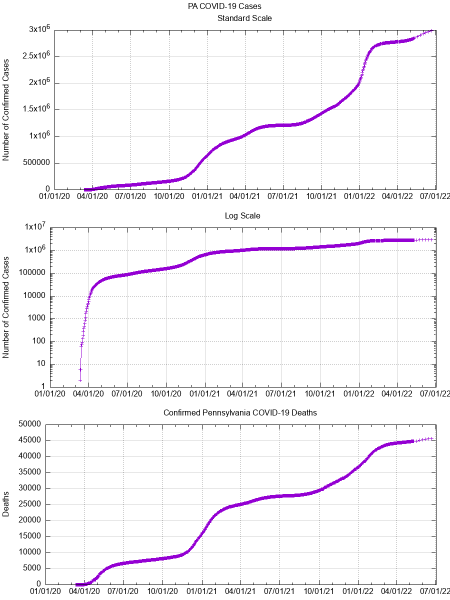
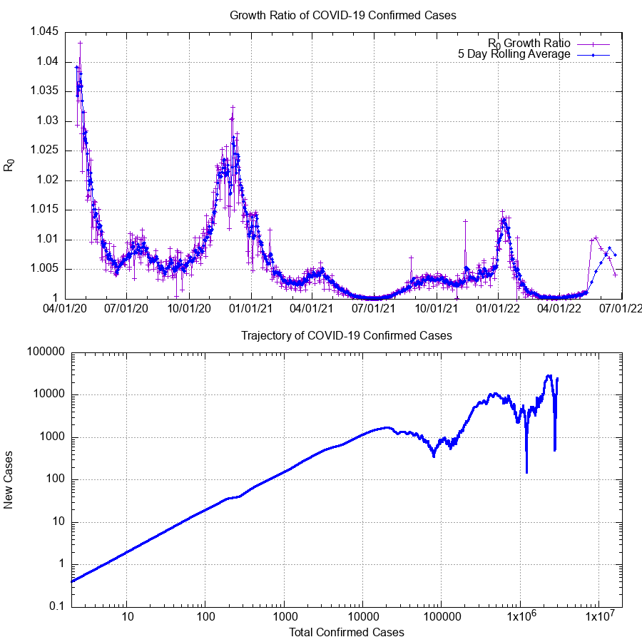
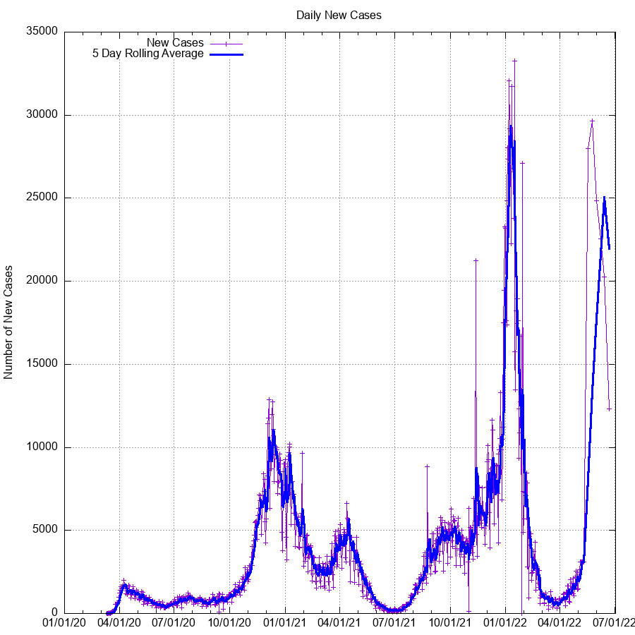

# Pennsylvania Coronavirus COVID-19 Scraper

In an effort to reduce the amount of strain on the Pennsylvania
Department of Health websites during the peak hours (especially around noon
when the daily updated information is posted), this script was created to quickly
and easily parse the information without any additional overhead.

The script can optionally highlight certain counties which you may be interested
in- in my case, I'm interested in Lancaster and Schuylkill counties.
If you wish to highlight different counties, simply update the array in the script.

I gave a brief talk about this repository as part of TechLancaster.
The video is available [here](https://youtu.be/c3zoHHA-1Nw).

## Using

To use this script, simply run it:
```
python covid.py
```

It's recommended that a virtualenv is used, for sanity reasons:

```
virtualenv env
source env/bin/activate
pip install -r requirements.txt
python covid.py
```


**NOTE:** Please be mindful that this script will still (in a minor way)
affect the bandwidth of the host. Please do not use this script to poll the
site more often than once every hour or so. The data does not change that often.

#### Database
Ideally, the daily cases and fatalities would be stored in a database for ease
of use and to allow for powerful querying features.
In an effort to allow for easy duplication of the setup, a `schema.sql` file is
provided to allow for a duplicate Postgres database to be used.

To set this up, ensure you have a working Postgres database, then run
```
psql < schema.sql
```
You may then load the data as you see fit, including external sources as
referenced in the schema file.
The schema file is annotated with comments indicating each section and it's
usage.

For convenience, a daily update SQL script has been provided as well, allowing
for easy and quick updating of the various stats which are not provided by the
Department of Health.

A further bonus of having the information in a database is the ability to hook
external tools into it for visualization and data processing uses, such as
Grafana.

#### Plot Generation
The scripts and data used to generate the graphs are also included in the
repository.
The data is not automatically populated in to the `gnuplot` data file, it is
instead calculated separately following the daily PA Dept of Health update,
and provided as described in this repository, so that careful attention can be
provided to ensure validity.
Simply install `gnuplot` and run:

```
gnuplot plot_PA_Cases.gpi
```

The image file will be updated at `cases.png`

## Updating Process
Typically, a daily update process is as follows:
1. Insert the daily data into the db:
    ```sql
    INSERT INTO covid19.covid19pa (date, confirmed, deaths) VALUES ("YYYY-MM-DD", ###, ###);
    ```
2. Run the daily update script:
    ```sh
    psql --file=daily-update.sql
    ```
3. Plot the data:
    ```sh
    gnuplot plot_PA_Cases.gpi
    ```
4. Update any daily events, if necessary:
    ```sql
    INSERT INTO covid19.pa_events (time, text) VALUES ('YYYY-MM-DD HH:MM:SS-4', 'Event');
    ```

## Current Cases

Below are graphs of confirmed cases, fatalities, and other potentially useful
data generated using the most recent available data and `gnuplot`.

R<sub>0</sub> is the 'Growth Factor'.
In the most basic terms, this is how many new cases are created by existing
cases.





For more information on how to read the trajectory
graph, please see this excellent video by Henry Reich of
[MinutePhysics](https://www.youtube.com/watch?v=54XLXg4fYsc).



## Calculation Formulas

The only two datapoints provided by the PA Department of Health are
`cases` and `deaths`.
The other values are calculated using reasonable estimations and approximations
to the scientific models.

This section will describe how the calculations are performed and the formulae
for each value shown in `cases.data`.

**Variables:**
- C<sub>t</sub>: Today's value for cases
- C<sub>t-1</sub>: Yesterday's value for cases

1. **New Cases:** The difference between the current value and the previous days value.
- C<sub>t</sub> - C<sub>t-1</sub>
2. **Growth Ratio:** The ratio of current cases to previous days cases. Rough approximation of the "R<sub>0</sub> Infectivity Rate".
- C<sub>t</sub> / C<sub>t-1</sub>
3. **Estimated Day:** The estimated number of cases for the day, based upon the growth ratio.
- C<sub>t-1</sub> * Growth Ratio<sub>t-1</sub>
4. **Off By:** The difference between the estimate and the actual daily count.
- -1 * (Estimated Day<sub>t</sub> - C<sub>t</sub>)
5. **Pct Error:** The percent error calculated for the difference between the estimated count and the actual count.
- ABS((Estimated Day<sub>t</sub> - C<sub>t</sub>) / C<sub>t</sub>)

## Disclaimers

As of 22 Apr 2020, the PA Dept of Health began providing 'probable' cases and
deaths, alongside confirmed data.
Because until this point, all data were assumed to be probable (and most likely)
the calculations will continue to use this metric.
Reasonable accommodations will be made to integrate the probable cases into error
calculations, where possible.
It's also important to note that the numbers do not identify which counties in
particular are included in the 'probable' counts, so it's presently impossible
do differentiate or reconcile the numbers.

This information is provided as part of an amateur attempt to analyze the data.
This information should not be interpreted as exact scientific analysis, nor
has it been peer reviewed in any way.
Nonetheless, every attempt has been made to validate the accuracy of the
numbers, such as providing a value of percent-error and a steadfast policy of +1
day estimations, only.

The only 'exact' values are those for the daily cases, deaths, and net daily-new
cases, insofar as they have been reported by the Pennsylvania Department of
Heath.
For example, the values for R<sub>0</sub> are approximations, at best.
For more precise R<sub>0</sub> calculations, [other
sources](https://github.com/k-sys/covid-19/blob/master/Realtime%20R0.ipynb)
should be used instead.

For a more scientific and precise analysis, it is recommended that you seek out
reporting performed by actual epidemiologists and data scientists.

## Notable Changes

- 27 Apr 2020: Updated method for creating the data file. Previously, data for
  each day was computed by manual processes in a spreadsheet. As of today, all
  calculated values are processed by the database and provided as output
  (i.e. there is no spreadsheet involved anymore). As a result, this allows for
  a more 'open' view of calculations, since the `.sql` file used to update the
  daily values can also be provided for replication elsewhere.
  Notably, the plotted output does not change between this and the parent
  commit, strongly indicating that there are no changes to the fundamental data.

- 7 May 2020: Updated plot method for Trajectory graph. This averaging plot
  (as opposed to the previous exact data plot) more closely matches the ideals
  and functions behind the original plot design from MinutePhysics. It is a
  'pessimistic' interpretation of the data, and will therefore show a downturn
  more clearly when the increase of infection rate is slowing.

- 27 May 2020: As a fun little add on, the decoded text version of the genome has
  been added to the repository.

## Sample Output
```
* Map, table and case count last updated at 12:00 p.m. on 3/26/2020
1,687 cases confirmed statewide
16 deaths confirmed statewide
48 of 67 counties affected
Adams county: 7 cases, 0 deaths
Allegheny county: 133 cases, 2 deaths
Armstrong county: 1 cases, 0 deaths
Beaver county: 13 cases, 0 deaths
Berks county: 36 cases, 0 deaths
Blair county: 1 cases, 0 deaths
Bradford county: 2 cases, 0 deaths
Bucks county: 107 cases, 0 deaths
Butler county: 19 cases, 1 deaths
Cambria county: 1 cases, 0 deaths
Carbon county: 2 cases, 0 deaths
Centre county: 9 cases, 0 deaths
Chester county: 84 cases, 0 deaths
Clearfield county: 2 cases, 0 deaths
Columbia county: 3 cases, 0 deaths
Crawford county: 1 cases, 0 deaths
Cumberland county: 15 cases, 0 deaths
Dauphin county: 13 cases, 0 deaths
Delaware county: 156 cases, 1 deaths
Erie county: 4 cases, 0 deaths
Fayette county: 8 cases, 0 deaths
Franklin county: 5 cases, 0 deaths
Greene county: 3 cases, 0 deaths
Indiana county: 1 cases, 0 deaths
Juniata county: 1 cases, 0 deaths
Lackawanna county: 28 cases, 2 deaths
Warning: 21 active cases in Lancaster county.
Lancaster county: 21 cases, 0 deaths
Lawrence county: 1 cases, 0 deaths
Lebanon county: 4 cases, 0 deaths
Lehigh county: 63 cases, 1 deaths
Luzerne county: 36 cases, 1 deaths
Lycoming county: 1 cases, 0 deaths
Mercer county: 3 cases, 0 deaths
Monroe county: 67 cases, 2 deaths
Montgomery county: 282 cases, 2 deaths
Montour county: 4 cases, 0 deaths
Northampton county: 56 cases, 3 deaths
Philadelphia county: 402 cases, 1 deaths
Pike county: 15 cases, 0 deaths
Potter county: 1 cases, 0 deaths
Warning: 9 active cases in Schuylkill county.
Schuylkill county: 9 cases, 0 deaths
Somerset county: 2 cases, 0 deaths
Susquehanna county: 1 cases, 0 deaths
Warren county: 1 cases, 0 deaths
Washington county: 12 cases, 0 deaths
Wayne county: 6 cases, 0 deaths
Westmoreland county: 24 cases, 0 deaths
York county: 21 cases, 0 deaths
```

## Contributing

Contributions are welcome.
Please ensure that any modifications to the database methods are tested, and
validated against a freshly initialized copy of the DB.

PR's related to improving the accuracy and precision of the Growth Ratio are
welcomed.
